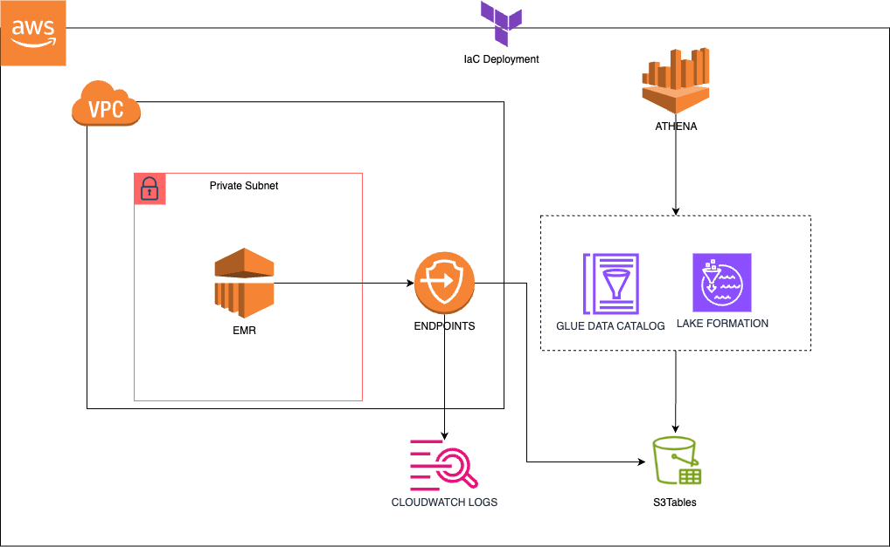

# aws-iceberg-s3tables

## Overview
This project automates the creation and management of S3Tables that integrate with AWS analytics services such as Amazon Athena, EMR, AWS Glue Data Catalog, and AWS Lake Formation. Using Terraform, the infrastructure is provisioned to build a scalable, cost-effective data lake solution.

## Documentation
* [S3Tables](https://docs.aws.amazon.com/AmazonS3/latest/userguide/s3-tables.html)
* [AWS Terraform Registry](https://registry.terraform.io/providers/hashicorp/aws/latest/docs)

## Architecture
  

## Prerequisites
The AWS CLI must be set up and credentials configured

## Installation

1. Replace and export with your correct value:

  ```bash
  export TF_VAR_aws_user="?"
  ```

2. Create infrastructure:

  ```bash
  terraform -chdir="./terraform" init -upgrade
  terraform -chdir="./terraform" apply --auto-approve
  ```

3. Get the output variables:

  ```bash
  export EMR_APP_ID="$(terraform -chdir="./terraform" output -raw emr_app_id)"
  export REGION="$(terraform -chdir="./terraform" output -raw region)"
  export ACCOUNT_ID="$(terraform -chdir="./terraform" output -raw account_id)"
  export BUCKET_AUX="$(terraform -chdir="./terraform" output -raw bucket_aux)"
  export TABLEBUCKET_NAME="$(terraform -chdir="./terraform" output -raw table_bucket)"
  export TABLEBUCKET_ARN="$(terraform -chdir="./terraform" output -raw table_bucket_arn)"
  export NAMESPACE="$(terraform -chdir="./terraform" output -raw namespace)"
  export TABLE="$(terraform -chdir="./terraform" output -raw table)"
  export EMR_ROLE="$(terraform -chdir="./terraform" output -raw emr_role)"
  export GROUP_CLOUDWATCH="$(terraform -chdir="./terraform" output -raw group_cloudwatch)"
  export ATHENA_WORKGROUP="$(terraform -chdir="./terraform" output -raw athena_workgroup)"
  ```

4. Create Glue Data Catalog (New terraform resource requested https://github.com/hashicorp/terraform-provider-aws/issues/40725):

  ```bash
  aws glue create-catalog \
  --region $REGION \
  --cli-input-json "{
    \"Name\": \"s3tablescatalog\",
    \"CatalogInput\": {
      \"FederatedCatalog\": {
        \"Identifier\": \"arn:aws:s3tables:${REGION}:${ACCOUNT_ID}:bucket/*\",
        \"ConnectionName\": \"aws:s3tables\"
      },
      \"CreateDatabaseDefaultPermissions\":[],
      \"CreateTableDefaultPermissions\":[]
    }
  }"
  ```

5. Give permission (Terraform bug: https://github.com/hashicorp/terraform-provider-aws/issues/40724):

  ```bash
  aws lakeformation grant-permissions \
  --region $REGION \
  --cli-input-json \
  "{
      \"Principal\": {
          \"DataLakePrincipalIdentifier\": \"arn:aws:iam::${ACCOUNT_ID}:user/${TF_VAR_aws_user}\"
      },
      \"Resource\": {
          \"Table\": {
              \"CatalogId\": \"${ACCOUNT_ID}:s3tablescatalog/${TABLEBUCKET_NAME}\",
              \"DatabaseName\": \"${NAMESPACE}\",
              \"Name\": \"${TABLE}\"
          }
      },
      \"Permissions\": [
          \"ALL\"
      ]
  }"
  ```

6. Upload code and jar:

  ```bash
  #Download and upload jar
  curl --create-dirs -O --output-dir ./libs/ https://repo1.maven.org/maven2/software/amazon/s3tables/s3-tables-catalog-for-iceberg-runtime/0.1.3/s3-tables-catalog-for-iceberg-runtime-0.1.3.jar
  aws s3 cp ./libs/s3-tables-catalog-for-iceberg-runtime-0.1.3.jar s3://$BUCKET_AUX/libs/

  #Upload pyspark scripts
  aws s3 cp ./src/main_emr.py s3://$BUCKET_AUX/src/
  ```

7. EMR serverless start job:

  ```bash
  emr_job=$(aws emr-serverless start-job-run \
  --name pyspark-job \
  --application-id $EMR_APP_ID \
  --execution-role-arn $EMR_ROLE \
  --job-driver "{
    \"sparkSubmit\": {
      \"entryPoint\": \"s3://${BUCKET_AUX}/src/main_emr.py\",
      \"entryPointArguments\": [
        \"--tablebucket_arn\", \"${TABLEBUCKET_ARN}\",
        \"--namespace\", \"${NAMESPACE}\",
        \"--table\", \"${TABLE}\"
      ],
      \"sparkSubmitParameters\": \"--jars s3://${BUCKET_AUX}/libs/s3-tables-catalog-for-iceberg-runtime-0.1.3.jar\"
    }
  }" \
  --configuration-overrides "{
    \"monitoringConfiguration\": {
      \"cloudWatchLoggingConfiguration\": {
        \"enabled\": true,
        \"logGroupName\": \"$GROUP_CLOUDWATCH\",
        \"logStreamNamePrefix\": \"pyspark-job\"
      }
    }
  }" \
  --region $REGION | jq -r '.jobRunId')

  #Get status, wait until "SUCCESS"
  aws emr-serverless get-job-run \
  --application-id $EMR_APP_ID \
  --job-run-id $emr_job \
  --region $REGION  | jq -r '.jobRun.state'
  ```

8. Query with Athena:

  ```bash
  query_id=$(aws athena start-query-execution \
  --query-string "SELECT * FROM \"s3tablescatalog/${TABLEBUCKET_NAME}\".\"${NAMESPACE}\".\"${TABLE}\" LIMIT 10" \
  --work-group $ATHENA_WORKGROUP \
  --region $REGION | jq -r '.QueryExecutionId')

  #Results
  aws athena get-query-results \
  --query-execution-id $query_id \
  --region $REGION | jq -r '.ResultSet.Rows[] | [.Data[].VarCharValue] | @tsv'
  ```

## Clean resources

  ```bash
  aws glue delete-catalog \
  --region $REGION \
  --catalog-id s3tablescatalog

  aws emr-serverless stop-application \
  --application-id $EMR_APP_ID \
  --region $REGION

  terraform -chdir="./terraform" destroy --auto-approve
  ```
